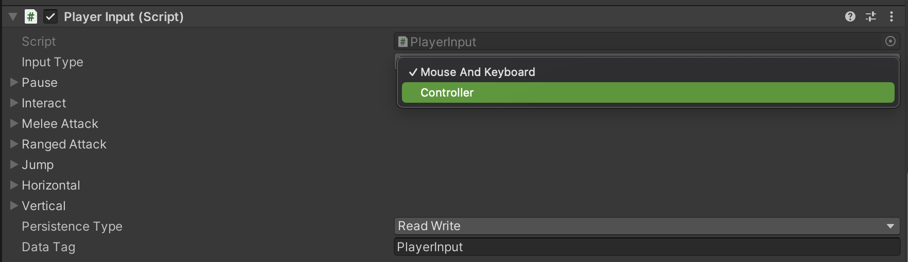
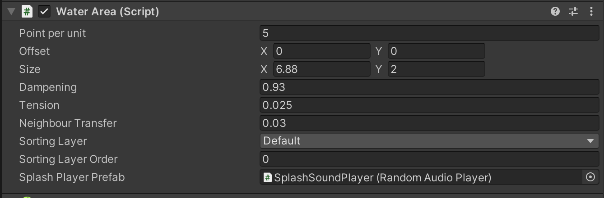
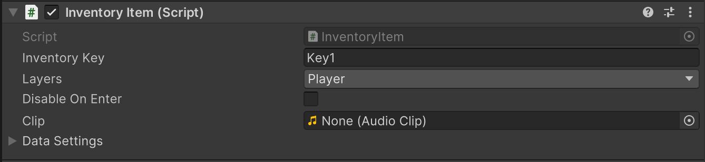
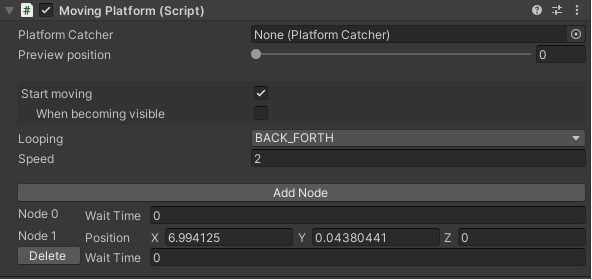
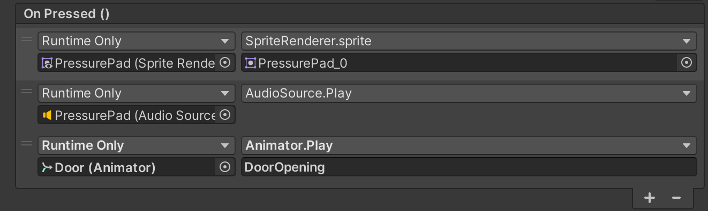
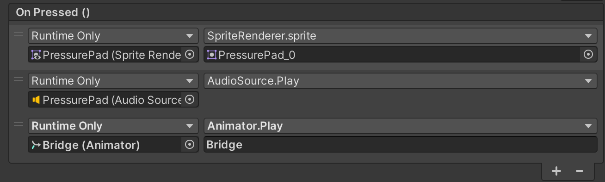
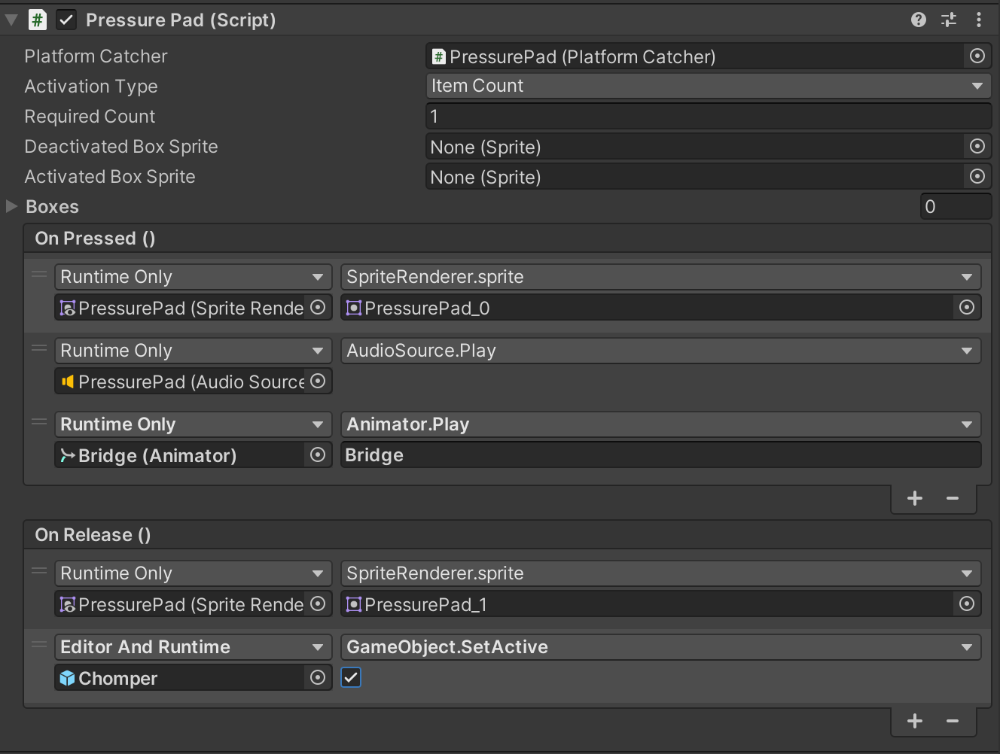
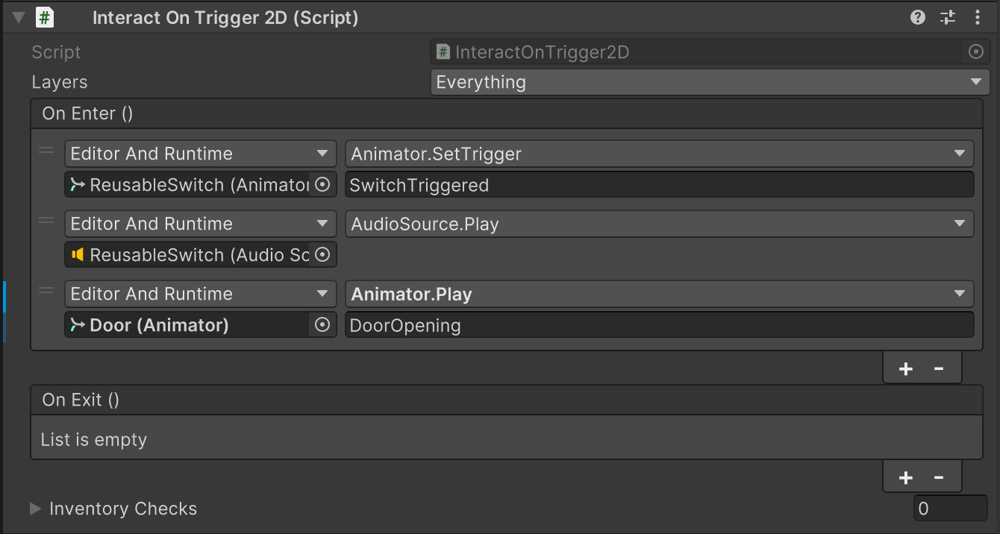
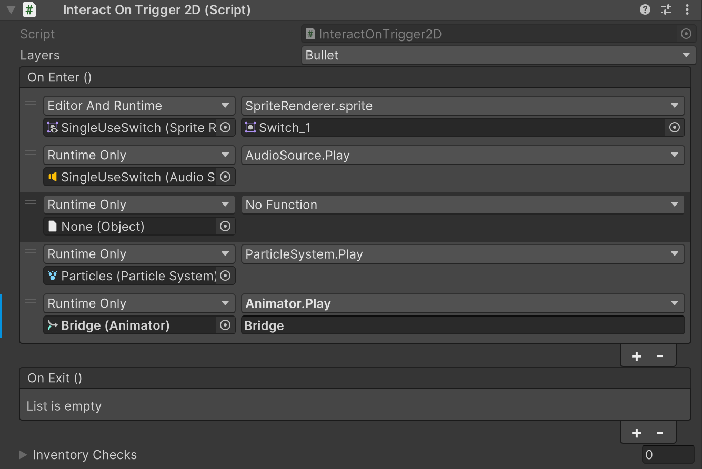
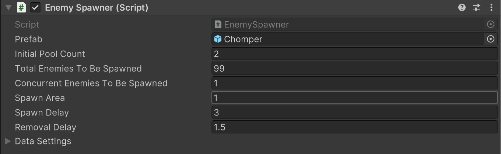

# COMP2150 Level Design Assessment Reference Guide
This document is intended as a reference guide for the various elements within the Level Design Task. This document is intended for you to use when completing the practical tasks and the final Level Design Task.

For additional details on assessment requirements, marking criteria and submission, please refer to the assignment specifications and the discussion forums.

Note: this document might need to be updated throughout semester. If so, you will receive a Pull Request to your repo to ensure you have the most up to date version. This is to ensure dynamic and ongoing support to you and your peers throughout semester.

## Tips

### Using the 2D Game Kit
Open the Unity project inside the repository. It contains three folders:

<b>2DGameKit:</b> The default assets for the project, including sprites, scripts, etc. You shouldn’t modify anything in this folder. However, there are a few levels in here you can play.

<b>Prefabs:</b> The Required and Optional features for your game. You shouldn’t modify any of these prefabs, but should be using them when building your level.

<b>Scenes:</b> This folder containsan End of Game scene (that you don’t need to modify) and a Main scene, which is the scene you will be building your level in. The scene contains the three keys and door that you will need to include in your final level, so you can relocate them to fit your design. There is also a "Testing" folder with a single Testing Grounds scene already in there. You are to edit this scene as part of the pracs, and also can create additional scenes for greyboxing and other prototyping where appropriate.

If you accidentally delete your scene, you can create a new one by pressing Kit Tools > Create Template Scene… > Create Template Scene in Assets. Don’t forget to rename this scene to “Main".

## Controls
The player can be controlled using a keyboard or gamepad. You can switch between these two input methods by selecting the Ellen prefab (Assets > 2DGamekit > Prefabs > Ellen) and setting the Input Type in the Player Input component in the Inspector. Do not modify these controls, as your marker will be working with multiple projects and will not have time to learn new schemes each assignment.

The controls are below. Note that Gamepad controls are based on Unity settings, and may differ based on controller used. Make sure you test this out and get familiar with the controller you plan on using for making your assignment (yes, you can bring your own to class!). I (Cameron) have been testing with a PS4 controller connected to my Mac.

|Keyboard control | Gamepad control | Action performed|
|-----|-----|----|
|A/D | Left analog stick | Move left/right|
|Space | B | Jump|
S| Down on the left analog stick | Crouch (combine with jump to move through a Passthrough Platform)|
K | X | Swing staff (after pickup)|
O |Right bumper | Shoot gun (after pickup)|
E| Y | Interact |

## The Hierarchy
The hierarchy is set up to contain all the important components to make the game work. You shouldn’t need to worry about most of these. Objects immediately underneath ---System---, cannot be children of a parent, as they contain helper code components that utilize something called DontDestroyOnLoad, such as the background music or the inventory. 

The main elements you should familiarise yourself with are:
1.	Ellen: The player character, found under ---PlayerAssets---. You shouldn’t need to change any of their settings, but you can place them at whatever starting point you want.
2.	Tilemap:  The tilemaps for the scene. These can be found under ---LevelAssets--- > TileMapGrid. We have included two tilemaps for you: the Foreground Tilemap for creating the main geometry of your level, and a Background Tilemap for adding background flourishes to give your level more depth and a sense of place.

3.	LevelAssets: This is where you should put the elements that make up your scene. You can add them as children, or add them immediately underneath this empty GameObject. 

# Prefabs
The following is a list of prefabs and where to find them within the Assets folder. 

## Required Prefabs
## Acid
Prefab: Prefabs/Required/Acid

The Acid hurts the player when they fall into it. The player will lose one (1) point of health and will be sent back to the last checkpoint (or the beginning of the level).

If you want to increase the size of the Acid, please do not use the scale tool, but instead edit the following script variables in the object, as seen below:

 
## Checkpoints
Prefab: Prefabs/Required/Checkpoint

If the player falls in acid they will restart at the most recent checkpoint they have touched, as long as they still have some health (if they have 0 health, they will restart at the beginning of the level). Note that checkpoints should be placed on the ground. Checkpoints light up upon activation.

## Chomper
Prefab: Prefabs/Required/Chomper
An enemy that bites/melee’s the player, dealing one (1) damage per hit.

## Health Pickup
Prefab: Prefabs/Required/HealthPickup

The Health Pickup adds one (1) point of health to the player, by default.

## Key
Prefab: Prefabs/Required/Key

A collectible key. You need to pick up three to open the Key Door (Note: Clip should be left blank).

## Key Door
Prefab: Prefabs/Required/KeyDoor

A door that opens when all three keys are collectable, transitioning to a different scene.

Note: The Key Door has already been configured to work in the assignment template to transition between your Main level & the Game Over scene. Please check the Level Design Discussion Forum on iLearn if you are encountering problems.

## Passthrough Platform
Prefabs:  Prefabs/Required/PassThroughPlatform | Prefabs/Required/PassThroughPlatformLong

This is a platform that the player can move upwards through. If the player is crouching on top of a Passthrough Platform and presses the jump button, they will instead fall through it.

## Moving Platforms
Prefabs:  Prefabs/Required/MovingPlatform | Prefabs/Required/MovingPlatformLong

A variant of the passthrough platform that follows a defined path, using nodes. Multiple nodes can be used, as well as multiple loop types (Once, back and forth). You can modify these settings in the Moving Platform Script Component.

Note: We have found setting the Speed variable to anything above 2 results in the player not moving with the platform properly when moving down. These speeds should be set to 2 by default, but it is worth checking if you have unexpected results. This becomes especially important if you have a platform activated by a pressure pad.
 
## Spikes
Prefab: Prefabs/Required/Spikes

When the player collides with the Spikes, the player loses one (1) point of health. 

## Spitter
Prefab: Prefabs/Required/Spitter
An enemy that spits acid at the player. Acid deals one (1) damage per hit.

## Weapon Pickups (Staff and Gun)
Prefab: Prefabs/Required/Staff_Pickup | Prefabs/Required/Gun_Pickup

The player does not initially have a weapon. There are two weapon pickups which vary on which weapon they give the player.

* Staff_Pickup gives the player the staff.
* Gun_Pickup gives the player the gun.

## Optional Prefabs
## Trigger Door
Prefab: Prefabs/Optional/TriggerDoor

A barrier that cannot be bypassed without triggering a thing (For example, a pressure pad, a switch, or a trigger collider, although you could probably find other ways to trigger it open). 

Can be open or closed using the Animator (Animator.Play(DoorOpening or DoorClosing). For instance, modifying a Pressure Pad's OnPressed() conditions as below will cause a door to open when the pressure pad is stood on (note that the door must be set to one in the scene, not the prefab itself!):

## Bridge
Prefab: Prefabs/Optional/Bridge

A barrier that cannot be bypassed without triggering a thing, similar to the TriggerDoor. Can be moved once using Animator.Play(Bridge). Example using a pressure pad:

## Pressure Pad
Prefab: Prefabs/Optional/PressurePad

An object that when the player stands on, can trigger some event (such as a bridge activating, or a door opening). This can be set by adding the object’s animator to the OnPressed() condition in the Inspector, as shown below. OnRelease() can also be used, so that other things happen when the pressure pad is stepped-off (such as doors closing again, or anything else you can access via the interface).

## Switches
Prefab: Prefabs/Optional/ReusableSwitch | Prefabs/Optional/SingleUseSwitch

A switch which, like the pressure pad, activates an object when it collides with another object. You can specify what object activates it (such as the player) by setting the “Layers” drop-down in the inspector. By default, it reacts to Everything.

### There are two switches: 
The Reusable Switch can be acivated multiple times. By default, it reacts to Everything.

The Single Use Switch can only be activated once. By default, it reacts to bullets.

## Pushable Block
Prefab: Prefabs/Optional/PushableBlock

A large block that the player can push back and forth by running into it. Can be stood on! It interacts with objects in interesting ways...

## Destructibles
Prefab: Prefabs/Optional/DestructableColumn | Prefabs/Optional/DestructableWall

Destructable objects that can be broken by hitting with the staff. The barrier has one (1) health by default. The wall has five (5) health by default.

## Enemy Spawner
Prefab: Prefabs/Optional/EnemySpawner

Can be used to spawn groups of enemies. This GameObject has several properties, such as making sure only x amount of enemies can be spawned at a time. Below is an example of an implementation set to ensure that only one enemy is spawned at a time and that enemy will always be there.

